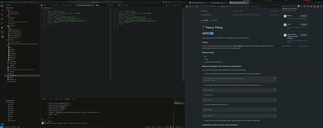

#  Fancy Tiling - GNOME Extension


[Fancy Zones](https://learn.microsoft.com/en-us/windows/powertoys/fancyzones) clone for GNOME 45.

## Features

- [x] Multiple layouts
- [x] Multiple zones
- [x] Move window to zone by mouse drag
- [x] Merge zones by mouse distance
- [x] Overlay customization
- [ ] Layout editor (WIP)
- [ ] Different layout for multiple monitores  (WIP)
- [ ] Keyboard shortcuts (WIP)
- [ ] Restore window to last zone (WIP)



## Usage
At the moment the activation key is the Ctrl-key. **Start dragging** a window and press **Ctrl**, release mouse button while holding Ctrl will move the window in the selected zone.

## Requierments
- git
- make
- gnome-shell-extension-tool

### Manual Installation (for testers & enthusiasts)

So, if you have all requierments installed you can proceed as follows.

1) Clone the repository via the git-clone command and change to the FancyTiling directory:
```
git clone https://github.com/DevRoamer/FancyTiling.git
cd fancy-tiling
```

2) If you have already installed FancyTiling, then please remove the existing installation via:
```
make uninstall
```

3) Install it via:
```
make install
```

4) Enable or disable the extension via:
```
make enable
```

```
make disable
```

5) Logout from the current GNOME session and login again for the changes to take effect.

## Customize zones (only for early releases)

To customize layout in early releases you need to edit the [gschema file](./src/schemas/org.gnome.shell.extensions.ft.gschema.xml) or use [dconf](https://wiki.gnome.org/Projects/dconf) and set 
```
/org/gnome/shell/extensions/ft/layouts
```

The default layout config:
```json
{
    "layouts": {
        "2x2": {                      /// layout name
            "zones": {                
                "1":[0,0,0.5,0.5],    /// zone name with 4 float values 
                "2":[0.5,0,1,0.5],    /// (0-1 -> 0 = left/top, 1 = right/bottom)
                "3":[0,0.5,0.5,1],    /// values are for [x, y, right, bottom]
                "4":[0.5,0.5,1,1]
            }
        },
        "2-1-2": {
            "zones": {
                "LeftTop":     [0,0,0.3,0.5],
                "LeftBottom":  [0,0.5,0.3,1],
                "Center":      [0.3,0,0.7,1],
                "RightTop":    [0.7,0,1,0.5],
                "RightBottom": [0.7,0.5,1,1]
            }
        }
    }
}
```

Compile and install after editing the gschema -> Logout and login.
